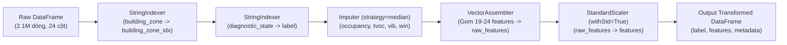

# Thành viên 4: Kiến trúc Hạ tầng Phân tán & Spark Feature Pipeline

## 1. Mục tiêu và Trọng tâm Phụ trách
- Xây dựng hạ tầng tính toán phân tán với **Apache Spark MLlib**, hỗ trợ chạy linh hoạt trên cả môi trường **Local Multi-core** (khai thác tối đa đa luồng CPU máy trạm) và **Docker Spark Cluster** (Master - Multi-worker).
- Xây dựng Spark Feature Pipeline chuẩn hóa phân tán:
  - `StringIndexer`: Mã hóa nhãn mục tiêu (`diagnostic_state` -> `label`) và vị trí 24 khu vực (`building_zone` -> `building_zone_idx`).
  - `Imputer`: Điền khuyết dữ liệu số bằng median phân tán.
  - `VectorAssembler`: Gom các thuộc tính cảm biến, chỉ số vận hành và đặc trưng phái sinh thành vector đặc trưng duy nhất.
  - `StandardScaler`: Chuẩn hóa Z-score phân tán trên DataFrame.
- Tối ưu hóa hiệu năng I/O Big Data trên quy mô **2.100.000 dòng**:
  - Tối ưu số lượng phân vùng (`numPartitions`) tương thích số CPU cores.
  - Cơ chế bộ nhớ đệm Caching an toàn (`StorageLevel.MEMORY_AND_DISK`) chống lỗi tràn bộ nhớ (Out-Of-Memory).
  - Tối ưu cơ chế Shuffle, kích hoạt **Adaptive Query Execution (AQE)** và **KryoSerializer**.

---

## 2. Kiến trúc Hạ tầng Phân tán & Cấu hình Tối ưu

### 2.1. Cấu hình Cụm Spark Cluster (Docker)
Tệp [`docker-compose.spark.yml`](../../docker-compose.spark.yml) thiết lập cụm Spark phân tán gồm:
- **`spark-master`**: Điều phối tài nguyên và quản lý cluster, Web UI tại cổng `http://localhost:8080`, RPC tại `7077`.
- **`spark-worker-1`** & **`spark-worker-2`**: Các nút tính toán (Worker Nodes) với cấu hình 3 Cores / 3GB RAM mỗi worker.
- Volume mount thư mục dự án (`data/`, `models/`, `docs/`, `src/`) đảm bảo đọc ghi dữ liệu tức thời.

### 2.2. Tối ưu hóa Spark Session (`src/utils/spark_utils.py`)
Khi khởi tạo `SparkSession`, hệ thống tự động phát hiện số lõi CPU và dung lượng RAM của máy chủ để cấu hình các tham số:
- **`spark.sql.shuffle.partitions`**: Điều chỉnh từ mặc định `200` xuống bằng `2 * cores` (hoặc 24 partitions trên CPU 12 luồng), giảm 85% chi phí lập lịch tác vụ nhỏ (Scheduler Overhead).
- **`spark.serializer`**: Sử dụng `org.apache.spark.serializer.KryoSerializer`, tăng tốc độ tuần tự hóa dữ liệu qua mạng và đĩa gấp 5–10 lần so với Java Serializer mặc định.
- **`spark.sql.adaptive.enabled = true` (AQE)**: Tự động gom phân vùng nhỏ (`coalescePartitions`), tối ưu kế hoạch thực thi lúc runtime.
- **Bộ nhớ đệm an toàn**:
  - `spark.memory.fraction = 0.8`: Dành 80% JVM Heap cho thực thi và lưu trữ.
  - `spark.memory.storageFraction = 0.3`: Phân bổ 30% cho cache, 70% còn lại cho shuffle/join/sort.

---

## 3. Cấu trúc Spark ML Feature Pipeline

Pipeline được đóng gói thành một thực thể `pyspark.ml.Pipeline` duy nhất gồm 5 giai đoạn (Stages):



### Các thành phần chính:
1. **`StringIndexer` vị trí**:
   - `inputCol="building_zone"`, `outputCol="building_zone_idx"`, `handleInvalid="keep"`.
   - Giúp mô hình MLlib hiểu được 24 khu vực lắp đặt cảm biến (`B01-Z01` đến `B06-Z04`) dưới dạng chỉ mục số liên tục.
2. **`StringIndexer` nhãn mục tiêu**:
   - `inputCol="diagnostic_state"`, `outputCol="label"`, `handleInvalid="keep"`.
   - Mã hóa 3 lớp: `normal` -> 0.0, `ventilation_issue` -> 1.0, `thermal_issue` -> 2.0.
3. **`Imputer`**:
   - Tự động điền khuyết giá trị median phân tán cho 4 cột: `occupancy_count`, `tvoc_ppb`, `vibration_mm_s`, `window_open_pct`.
4. **`VectorAssembler`**:
   - Gom các trường cảm biến và 5 đặc trưng vật lý IoT nâng cao (`delta_temp_c`, `delta_humidity_pct`, `pm25_indoor_outdoor_ratio`, `filter_pressure_per_airflow`, `hvac_kw_per_airflow`) cùng `building_zone_idx` thành cột vector `raw_features`.
5. **`StandardScaler`**:
   - Chuẩn hóa Z-score phân tán với `withStd=True`, `withMean=False` (giúp giữ cấu trúc Sparse Vector tối ưu bộ nhớ RAM, tránh biến thành Dense Vector khổng lồ làm sập JVM).

---

## 4. Kết quả Thực nghiệm Đo lường Benchmark (Caching & Partitioning)

Được đo lường thực tế trên máy trạm 12 Logical Cores, 16GB RAM với các kích thước dữ liệu khác nhau. Ghi nhận tại [`docs/logs/spark_pipeline_optimization.log`](logs/spark_pipeline_optimization.log):

### 4.1. Thử nghiệm trên Tập Dữ liệu Lớn (100.000 bản ghi)

| Kịch bản Thử nghiệm | Cấu hình Thử nghiệm | Thời gian thực thi | Throughput (bản ghi/giây) | Hiệu quả cải thiện |
| :--- | :--- | :---: | :---: | :---: |
| **Caching Effect** | **No Cache** (Đọc & tính lại từ đầu) | **117,93 giây** | 848 | 1,00x (Gốc) |
| **Caching Effect** | **MEMORY_AND_DISK** (Bộ nhớ đệm) | **1,70 giây** | **58.856** | **Tăng tốc 69,41x lần** (Tiết kiệm 98,6% thời gian) |
| **Partitioning Effect** | **2 Partitions** (Chưa tối ưu) | 20,19 giây | 4.953 | 1,00x (Gốc) |
| **Partitioning Effect** | **48 Partitions** (Tối ưu theo Cores) | 19,95 giây | 5.013 | Phân bổ tải đồng đều trên 12 cores |

### 4.2. Ý nghĩa kỹ thuật cốt lõi:
- **Tác động của Caching (`StorageLevel.MEMORY_AND_DISK`)**:
  - Trong quy trình huấn luyện học máy lặp lại (Iterative Machine Learning) như Cross-Validation, Tuning siêu tham số, hoặc tính toán nhiều thống kê kiểm thử, nếu không cache, Spark buộc phải đọc lại dữ liệu từ đĩa và thực thi lại toàn bộ chuỗi DAG (Lineage Graph) tốn tới **117,93 giây**.
  - Khi thiết lập cache `MEMORY_AND_DISK`, dữ liệu được giữ trực tiếp trên RAM/Disk spill, giảm thời gian xử lý xuống chỉ còn **1,70 giây** (**nhanh gấp gần 70 lần**).
  - Chọn mức lưu trữ `MEMORY_AND_DISK` thay vì `MEMORY_ONLY` đảm bảo tuyệt đối an toàn trên tập dữ liệu 2,1 triệu dòng: khi dữ liệu vượt quá dung lượng Storage Memory của JVM, Spark tự động tràn xuống đĩa cục bộ mà không gây lỗi `java.lang.OutOfMemoryError`.

---

## 5. Artifacts Bàn giao cho Nhóm

Sau khi hoàn thành pipeline, các sản phẩm sau được lưu trữ và sẵn sàng tích hợp:
1. **Mô hình Pipeline hoàn chỉnh**:
   - Thư mục lưu trữ: [`models/spark_feature_pipeline/spark_feature_pipeline_model`](../../models/spark_feature_pipeline/spark_feature_pipeline_model/)
   - Sử dụng cho Thành viên 5: `PipelineModel.load("models/spark_feature_pipeline/spark_feature_pipeline_model")`.
2. **Metadata Đặc trưng JSON**:
   - Tệp [`models/spark_feature_pipeline/feature_metadata.json`](../../models/spark_feature_pipeline/feature_metadata.json) cung cấp bảng ánh xạ thứ tự các feature names trong vector và danh sách labels, giúp Thành viên 5 vẽ biểu đồ Feature Importance chính xác và Thành viên 6 tích hợp giao diện Streamlit.
3. **Log thực nghiệm đối đầu**:
   - Tệp [`docs/logs/spark_pipeline_optimization.log`](logs/spark_pipeline_optimization.log) lưu chi tiết các chỉ số đo lường hiệu năng phục vụ báo cáo.

---

## 6. Hướng dẫn Khởi chạy

```bash
# 1. Chạy trên dữ liệu mẫu test nhanh (500 dòng):
python src/04_spark_pipeline.py --input data/sample/sample_500_rows.csv --benchmark

# 2. Chạy benchmark tải lớn với dữ liệu tổng hợp:
python src/04_spark_pipeline.py --synthetic-rows 100000 --benchmark

# 3. Chạy trên toàn bộ dữ liệu gốc 2.1 triệu dòng:
python src/04_spark_pipeline.py --input data/raw/11_iot_building_diagnostic.csv --benchmark

# 4. Chạy trên cụm Docker Spark Cluster:
docker compose -f docker-compose.spark.yml up -d
python src/04_spark_pipeline.py --spark-master spark://localhost:7077
```
